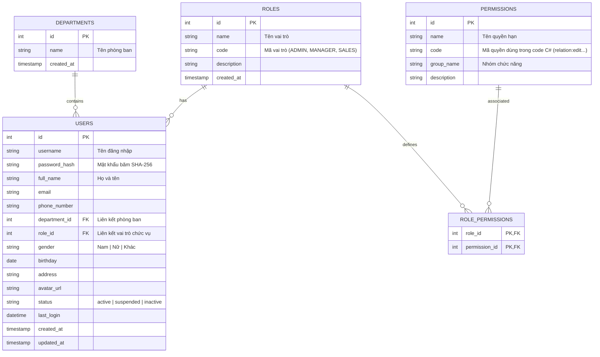

# Kế hoạch triển khai Hệ thống MySQL: Quản lý Người dùng & Phòng ban

Cơ sở dữ liệu sẽ chạy trên **MySQL** trên VPS. 

**Báo giá, Chi tiết báo giá và Đề xuất mua vật tư** sẽ tạm thời tiếp tục được lưu trữ trên **Google Sheets** như hiện tại. MySQL sẽ được sử dụng để quản lý thông tin tài khoản Người dùng (Users) và các Phòng ban (Departments) để xử lý xác thực và phân quyền xem dữ liệu tại Client.

---

## 1. Sơ đồ quan hệ thực thể (MySQL)



---

## 2. MySQL DDL Khởi tạo Cơ sở dữ liệu

Dưới đây là mã SQL khởi chạy trực tiếp trên MySQL (phpMyAdmin, DBeaver, Laragon...) để tạo 5 bảng phân quyền:

```sql
-- 1. Bảng Phòng ban
CREATE TABLE IF NOT EXISTS `departments` (
    `id` INT AUTO_INCREMENT PRIMARY KEY,
    `name` VARCHAR(100) NOT NULL UNIQUE,
    `created_at` TIMESTAMP DEFAULT CURRENT_TIMESTAMP
) ENGINE=InnoDB DEFAULT CHARSET=utf8mb4 COLLATE=utf8mb4_unicode_ci;

-- 2. Bảng Vai trò (Roles)
CREATE TABLE IF NOT EXISTS `roles` (
    `id` INT AUTO_INCREMENT PRIMARY KEY,
    `name` VARCHAR(100) NOT NULL UNIQUE,
    `code` VARCHAR(50) NOT NULL UNIQUE,
    `description` VARCHAR(255) NULL,
    `created_at` TIMESTAMP DEFAULT CURRENT_TIMESTAMP
) ENGINE=InnoDB DEFAULT CHARSET=utf8mb4 COLLATE=utf8mb4_unicode_ci;

-- 3. Bảng Quyền hạn chi tiết (Permissions)
CREATE TABLE IF NOT EXISTS `permissions` (
    `id` INT AUTO_INCREMENT PRIMARY KEY,
    `name` VARCHAR(100) NOT NULL,
    `code` VARCHAR(100) NOT NULL UNIQUE,
    `group_name` VARCHAR(50) NOT NULL,
    `description` VARCHAR(255) NULL
) ENGINE=InnoDB DEFAULT CHARSET=utf8mb4 COLLATE=utf8mb4_unicode_ci;

-- 4. Bảng trung gian Vai trò - Quyền hạn (Role Permissions)
CREATE TABLE IF NOT EXISTS `role_permissions` (
    `role_id` INT NOT NULL,
    `permission_id` INT NOT NULL,
    PRIMARY KEY (`role_id`, `permission_id`),
    CONSTRAINT `fk_rp_role` FOREIGN KEY (`role_id`) REFERENCES `roles` (`id`) ON DELETE CASCADE,
    CONSTRAINT `fk_rp_permission` FOREIGN KEY (`permission_id`) REFERENCES `permissions` (`id`) ON DELETE CASCADE
) ENGINE=InnoDB DEFAULT CHARSET=utf8mb4 COLLATE=utf8mb4_unicode_ci;

-- 5. Bảng Người dùng
CREATE TABLE IF NOT EXISTS `users` (
    `id` INT AUTO_INCREMENT PRIMARY KEY,
    `username` VARCHAR(50) NOT NULL UNIQUE,          -- Tên đăng nhập
    `password_hash` VARCHAR(255) NOT NULL,          -- Mật khẩu băm SHA-256
    `full_name` VARCHAR(100) NOT NULL,             -- Họ và tên
    `email` VARCHAR(100) NULL,                      -- Email công ty
    `phone_number` VARCHAR(15) NULL,                -- Số điện thoại
    
    -- Phòng ban & Chức vụ
    `department_id` INT NULL,                       -- Thuộc phòng ban (Foreign Key)
    `role_id` INT NULL,                             -- Vai trò/Chức vụ (Foreign Key)
    
    -- Thông tin cá nhân
    `gender` ENUM('Nam', 'Nữ', 'Khác') NULL,       -- Giới tính
    `birthday` DATE NULL,                           -- Ngày sinh
    `address` VARCHAR(255) NULL,                    -- Địa chỉ
    `avatar_url` VARCHAR(255) NULL,                 -- Ảnh đại diện nhân viên

    -- Quản trị hệ thống
    `status` ENUM('active', 'suspended', 'inactive') NOT NULL DEFAULT 'active', -- Trạng thái tài khoản
    `last_login` DATETIME NULL,                     -- Lần đăng nhập cuối
    `created_at` TIMESTAMP DEFAULT CURRENT_TIMESTAMP,
    `updated_at` TIMESTAMP DEFAULT CURRENT_TIMESTAMP ON UPDATE CURRENT_TIMESTAMP,
    
    CONSTRAINT `fk_users_department` FOREIGN KEY (`department_id`) 
        REFERENCES `departments` (`id`) ON DELETE SET NULL,
    CONSTRAINT `fk_users_role` FOREIGN KEY (`role_id`) 
        REFERENCES `roles` (`id`) ON DELETE SET NULL,
    INDEX `idx_users_status` (`status`),
    INDEX `idx_users_dept` (`department_id`)
) ENGINE=InnoDB DEFAULT CHARSET=utf8mb4 COLLATE=utf8mb4_unicode_ci;
```

### Chèn dữ liệu mẫu ban đầu & Tài khoản Admin mặc định (Mật khẩu: `admin123`)

```sql
-- 1. Thêm Phòng ban mặc định
INSERT INTO `departments` (`id`, `name`) 
VALUES (1, 'Ban Giám Đốc')
ON DUPLICATE KEY UPDATE `name` = `name`;

-- 2. Thêm Vai trò mặc định
INSERT INTO `roles` (`id`, `name`, `code`, `description`) VALUES
(1, 'Quản trị hệ thống', 'ADMIN', 'Toàn quyền hệ thống'),
(2, 'Quản lý phòng ban', 'MANAGER', 'Quản lý nhân sự và xem báo giá phòng ban'),
(3, 'Nhân viên kinh doanh', 'SALES', 'Tạo và quản lý báo giá cá nhân')
ON DUPLICATE KEY UPDATE `name` = `name`;

-- 3. Thêm Quyền hạn chi tiết
INSERT INTO `permissions` (`id`, `name`, `code`, `group_name`) VALUES
(1, 'Xem liên kết sản phẩm', 'relation:view', 'Sản phẩm'),
(2, 'Chỉnh sửa liên kết sản phẩm', 'relation:edit', 'Sản phẩm'),
(3, 'Xem báo giá cá nhân', 'quotation:view_own', 'Báo giá'),
(4, 'Xem báo giá phòng ban', 'quotation:view_dept', 'Báo giá'),
(5, 'Xem tất cả báo giá', 'quotation:view_all', 'Báo giá'),
(6, 'Xóa/Reset tất cả dữ liệu báo giá', 'quotation:delete_all', 'Báo giá'),
(7, 'Đổi Sheet/Tab cấu hình', 'config:change_sheet', 'Hệ thống')
ON DUPLICATE KEY UPDATE `name` = `name`;

-- 4. Gán quyền cho Vai trò ADMIN (Quyền 1 -> 7)
INSERT INTO `role_permissions` (`role_id`, `permission_id`) VALUES 
(1, 1), (1, 2), (1, 3), (1, 4), (1, 5), (1, 6), (1, 7)
ON DUPLICATE KEY UPDATE `role_id` = `role_id`;

-- 5. Gán quyền cho Vai trò MANAGER
INSERT INTO `role_permissions` (`role_id`, `permission_id`) VALUES 
(2, 1), (2, 3), (2, 4)
ON DUPLICATE KEY UPDATE `role_id` = `role_id`;

-- 6. Gán quyền cho Vai trò SALES
INSERT INTO `role_permissions` (`role_id`, `permission_id`) VALUES 
(3, 1), (3, 3)
ON DUPLICATE KEY UPDATE `role_id` = `role_id`;

-- 7. Thêm tài khoản Admin mặc định gắn với role_id = 1
INSERT INTO `users` (`username`, `password_hash`, `full_name`, `email`, `phone_number`, `department_id`, `role_id`, `status`)
VALUES (
    'admin', 
    SHA2('admin123', 256), 
    'Quản trị viên', 
    'admin@vnecco.com', 
    '0912345678', 
    1, 
    1, -- Role ADMIN
    'active'
)
ON DUPLICATE KEY UPDATE `full_name` = `full_name`;
```

---

## 3. Cấu hình C# Kết nối tới MySQL (MySql.Data)

### Bước 3.1: Thêm gói thư viện vào [packages.config](file:///e:/VNECCO/ElectricalCacbinetQuotationSoftware/ECQ_Soft/packages.config)
```xml
<package id="MySql.Data" version="8.0.33" targetFramework="net472" />
```

### Bước 3.2: Thêm tham chiếu vào [ECQ_Soft.csproj](file:///e:/VNECCO/ElectricalCacbinetQuotationSoftware/ECQ_Soft/ECQ_Soft.csproj)
```xml
    <Reference Include="MySql.Data, Version=8.0.33.0, Culture=neutral, PublicKeyToken=c5687fc88969c44d, processorArchitecture=MSIL">
      <HintPath>..\packages\MySql.Data.8.0.33\lib\net472\MySql.Data.dll</HintPath>
    </Reference>
```

### Bước 3.3: Lớp dịch vụ `DatabaseService.cs` (Cập nhật cho MySQL)

```csharp
using System;
using System.Data;
using MySql.Data.MySqlClient;
using System.Configuration;

namespace ECQ_Soft.Services
{
    public static class DatabaseService
    {
        private static string GetConnectionString()
        {
            return ConfigurationManager.ConnectionStrings["MySqlVPS"]?.ConnectionString 
                ?? "Server=vps_ip_or_domain;Port=3306;Database=ecq_db;Uid=ecq_user;Pwd=secret_password;SslMode=Preferred;Pooling=true;Min Pool Size=5;Max Pool Size=50;";
        }

        public static MySqlConnection GetConnection()
        {
            var conn = new MySqlConnection(GetConnectionString());
            conn.Open();
            return conn;
        }

        public static DataTable ExecuteQuery(string sql, MySqlParameter[] parameters = null)
        {
            using (var conn = GetConnection())
            using (var cmd = new MySqlCommand(sql, conn))
            {
                if (parameters != null) cmd.Parameters.AddRange(parameters);
                using (var adapter = new MySqlDataAdapter(cmd))
                {
                    var dt = new DataTable();
                    adapter.Fill(dt);
                    return dt;
                }
            }
        }
    }
}
```

---

## 4. Phân quyền và Lọc dữ liệu Google Sheets tại Client

### Lớp quản lý phiên làm việc `UserSession.cs`
```csharp
using System;
using System.Collections.Generic;

public static class UserSession
{
    public static int UserId { get; set; }
    public static string Username { get; set; }
    public static string FullName { get; set; }
    public static int RoleId { get; set; }
    public static string RoleCode { get; set; } // "ADMIN", "MANAGER", "SALES"
    public static int? DepartmentId { get; set; }
    
    // Lưu trữ danh sách mã quyền hạn của người dùng hiện tại
    public static List<string> Permissions { get; set; } = new List<string>();

    // Hàm kiểm tra quyền
    public static bool HasPermission(string permissionCode)
    {
        if (Permissions == null) return false;
        // ADMIN mặc định có tất cả quyền
        if (string.Equals(RoleCode, "ADMIN", StringComparison.OrdinalIgnoreCase)) return true;
        return Permissions.Contains(permissionCode, StringComparer.OrdinalIgnoreCase);
    }
}
```

### Bước 4.1: Tải danh sách quyền khi Đăng nhập và Lấy danh sách phòng ban

Thêm hàm tải quyền của người dùng sau khi đăng nhập thành công vào [DatabaseService.cs](file:///e:/VNECCO/ElectricalCacbinetQuotationSoftware/ECQ_Soft/Services/DatabaseService.cs):
```csharp
public static List<string> GetUserPermissions(int roleId)
{
    var permissions = new List<string>();
    string sql = @"
        SELECT p.code 
        FROM role_permissions rp
        JOIN permissions p ON rp.permission_id = p.id
        WHERE rp.role_id = @roleId";
    
    var parameters = new MySqlParameter[] {
        new MySqlParameter("@roleId", roleId)
    };
    
    try
    {
        DataTable dt = ExecuteQuery(sql, parameters);
        foreach (DataRow row in dt.Rows)
        {
            permissions.Add(row["code"].ToString());
        }
    }
    catch (Exception ex)
    {
        System.Diagnostics.Debug.WriteLine("Lỗi tải quyền hạn: " + ex.Message);
    }
    return permissions;
}
```

Và hàm lấy danh sách tài khoản cùng phòng ban:
```csharp
public static List<string> GetUsernamesInSameDepartment(int departmentId)
{
    var usernames = new List<string>();
    string sql = "SELECT username FROM users WHERE department_id = @deptId AND status = 'active'";
    
    var parameters = new MySqlParameter[] {
        new MySqlParameter("@deptId", departmentId)
    };
    
    DataTable dt = DatabaseService.ExecuteQuery(sql, parameters);
    foreach (DataRow row in dt.Rows)
    {
        usernames.Add(row["username"].ToString());
    }
    return usernames;
}
```

### Bước 4.2: Lọc báo giá từ Google Sheets dựa trên Quyền hạn

```csharp
public static List<QuotationRow> FilterQuotations(List<QuotationRow> allRows)
{
    // 1. Nếu có quyền xem tất cả
    if (UserSession.HasPermission("quotation:view_all"))
    {
        return allRows;
    }
    
    // 2. Nếu có quyền xem phòng ban (Manager)
    if (UserSession.HasPermission("quotation:view_dept"))
    {
        var allowedUsernames = GetUsernamesInSameDepartment(UserSession.DepartmentId ?? 0);
        allowedUsernames.Add(UserSession.Username); // Bao gồm cả chính mình
        
        return allRows.Where(r => allowedUsernames.Contains(r.CreatorUsername, StringComparer.OrdinalIgnoreCase)).ToList();
    }
    
    // 3. Nếu chỉ có quyền xem cá nhân (Sales) hoặc mặc định
    return allRows.Where(r => string.Equals(r.CreatorUsername, UserSession.Username, StringComparison.OrdinalIgnoreCase)).ToList();
}
```

---

## 5. Hướng dẫn Chuyển đổi mã SQL sang SQL Server sau này

Nếu sau này bạn muốn chuyển đổi từ **MySQL** sang **SQL Server (MSSQL)**, bạn chỉ cần thay đổi các điểm cú pháp sau:

| Đặc trưng | Cú pháp MySQL | Cú pháp SQL Server (MSSQL) |
| :--- | :--- | :--- |
| **Khóa tự tăng** | `id INT AUTO_INCREMENT PRIMARY KEY` | `id INT IDENTITY(1,1) PRIMARY KEY` |
| **Ký tự Unicode** | `name VARCHAR(100)` (ở bảng utf8mb4) | `name NVARCHAR(100)` |
| **Ngày giờ mặc định** | `DEFAULT CURRENT_TIMESTAMP` | `DEFAULT GETDATE()` |
| **Bộ giá trị giới hạn** | `ENUM('sales', 'manager', 'admin')` | `VARCHAR(20) CHECK (role IN (...))` |
| **Hàm băm chuỗi** | `SHA2('chuoi', 256)` | `CONVERT(VARCHAR(64), HASHBYTES('SHA2_256', 'chuoi'), 2)` |
| **Bảo vệ tên cột/bảng** | Dùng dấu backtick: \`users\` (không bắt buộc) | Dùng ngoặc vuông: `[users]` (không bắt buộc) |
